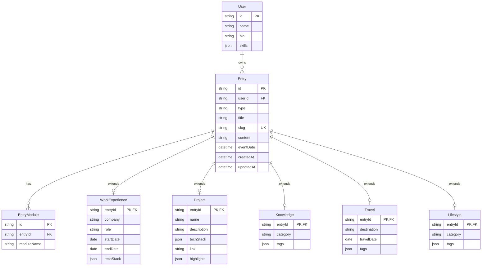

好的，我现在帮你整理一份 **多表关联的数据库设计文档**，你可以直接保存为 `DATABASE.md` 放在项目根目录下。

---

```markdown
# 数据库设计文档

**版本**：v1.0  
**最后更新**：2026-06-02  
**说明**：本文档定义 Hexiyuan's Digital Garden 的完整数据库结构，采用 **多表关联** 方案，便于扩展和维护。

---

## 一、设计原则

- **核心主表 + 类型子表**：所有内容共享的字段存于 `Entry`，各类型特有字段独立建表。
- **模块分发表**：通过 `EntryModule` 关联条目与展示模块，支持一条内容多处展示。
- **预留用户表**：当前单用户，未来可扩展。
- **时间轴统一**：所有具有时间属性的条目通过 `Entry.eventDate` 排序，缺省使用 `createdAt`。

---

## 二、表结构定义

### 1. User（预留，当前仅需单用户）

| 字段 | 类型 | 说明 |
| :--- | :--- | :--- |
| id | String (UUID) | 主键 |
| name | String | 脱敏姓名 |
| bio | String? | 个人简介 |
| avatar | String? | 头像 URL |
| skills | Json? | 技能数组 |
| createdAt | DateTime | 创建时间 |
| updatedAt | DateTime | 更新时间 |

### 2. Entry（核心主表）

| 字段 | 类型 | 说明 |
| :--- | :--- | :--- |
| id | String (UUID) | 主键 |
| userId | String | 关联 User |
| type | EntryType | 枚举（见下方） |
| title | String | 标题 |
| slug | String (唯一) | URL 标识 |
| content | String | Markdown 正文 |
| eventDate | DateTime? | 事件发生日期，空时取 createdAt |
| createdAt | DateTime | 创建时间（默认 now()） |
| updatedAt | DateTime | 更新时间 |

**EntryType 枚举值**：
```
work_experience, project, knowledge, travel, lifestyle, other
```

### 3. EntryModule（模块分发表）

| 字段 | 类型 | 说明 |
| :--- | :--- | :--- |
| id | String (UUID) | 主键 |
| entryId | String (FK) | 关联 Entry |
| moduleName | ModuleName | 枚举（见下方） |

**ModuleName 枚举值**：
```
resume, timeline, projects, knowledge, travel, lifestyle, blog, games
```
- 一条 Entry 可对应多条 EntryModule 记录，实现多处展示。

### 4. WorkExperience（工作经历子表）

| 字段 | 类型 | 说明 |
| :--- | :--- | :--- |
| entryId | String (PK, FK) | 一对一关联 Entry |
| company | String | 脱敏后的公司名 |
| role | String | 职位 |
| startDate | DateTime? | 开始日期 |
| endDate | DateTime? | 结束日期 |
| techStack | Json? | 技术栈数组 |

### 5. Project（项目经历子表）

| 字段 | 类型 | 说明 |
| :--- | :--- | :--- |
| entryId | String (PK, FK) | 一对一关联 Entry |
| name | String | 项目名称 |
| description | String? | 简要描述 |
| techStack | Json? | 技术栈数组 |
| link | String? | 项目链接 |
| highlights | Json? | 亮点数组 |

### 6. Knowledge（知识库子表）

| 字段 | 类型 | 说明 |
| :--- | :--- | :--- |
| entryId | String (PK, FK) | 一对一关联 Entry |
| category | String? | 分类（如 React, CSS） |
| tags | Json? | 标签数组 |

### 7. Travel（旅行攻略子表）

| 字段 | 类型 | 说明 |
| :--- | :--- | :--- |
| entryId | String (PK, FK) | 一对一关联 Entry |
| destination | String | 目的地 |
| travelDate | DateTime? | 旅行日期 |
| tags | Json? | 标签数组 |

### 8. Lifestyle（生活方式子表）

| 字段 | 类型 | 说明 |
| :--- | :--- | :--- |
| entryId | String (PK, FK) | 一对一关联 Entry |
| category | String? | 分类（如美食、探店） |
| tags | Json? | 标签数组 |

---

## 三、关系总结（Mermaid ER 图）



---

## 四、常用查询示例

### 1. 成长时间轴（所有标记为 timeline 的条目）
```sql
SELECT e.* 
FROM Entry e
JOIN EntryModule em ON e.id = em.entryId
WHERE em.moduleName = 'timeline'
ORDER BY COALESCE(e.eventDate, e.createdAt) DESC;
```

### 2. 简历时间轴（仅工作经历类，且在 resume 模块）
```sql
SELECT e.*, we.company, we.role, we.startDate, we.endDate
FROM Entry e
JOIN EntryModule em ON e.id = em.entryId
JOIN WorkExperience we ON e.id = we.entryId
WHERE em.moduleName = 'resume' AND e.type = 'work_experience'
ORDER BY COALESCE(we.startDate, e.eventDate, e.createdAt) DESC;
```

### 3. 项目列表（type = project 且 module 含 projects）
```sql
SELECT e.*, p.name, p.description, p.techStack, p.link
FROM Entry e
JOIN EntryModule em ON e.id = em.entryId
JOIN Project p ON e.id = p.entryId
WHERE em.moduleName = 'projects'
ORDER BY e.eventDate DESC;
```

### 4. 知识库文章
```sql
SELECT e.*, k.category, k.tags
FROM Entry e
JOIN EntryModule em ON e.id = em.entryId
JOIN Knowledge k ON e.id = k.entryId
WHERE em.moduleName = 'knowledge'
ORDER BY e.createdAt DESC;
```

---

## 五、与 Prisma Schema 的映射

开发时按上述关系定义 `schema.prisma`，关键示例：

```prisma
model Entry {
  id        String   @id @default(uuid())
  userId    String
  type      EntryType
  title     String
  slug      String   @unique
  content   String
  eventDate DateTime?
  createdAt DateTime @default(now())
  updatedAt DateTime @updatedAt

  user         User          @relation(fields: [userId], references: [id])
  modules      EntryModule[]
  workExp      WorkExperience?
  project      Project?
  knowledge    Knowledge?
  travel       Travel?
  lifestyle    Lifestyle?
}

model EntryModule {
  id         String     @id @default(uuid())
  entryId    String
  moduleName ModuleName

  entry Entry @relation(fields: [entryId], references: [id])
}

model WorkExperience {
  entryId   String @id
  company   String
  role      String
  startDate DateTime?
  endDate   DateTime?
  techStack Json?

  entry Entry @relation(fields: [entryId], references: [id])
}

// 其他子表结构类似...
```

---

## 六、扩展说明

- **新增模块**（如 Games）：在 `ModuleName` 枚举加 `games`，新建 `Games` 子表关联 `Entry`，前端加路由 `/games` 即可。
- **导入时的默认时间**：若子表无日期且 `eventDate` 为空，后端写入 `eventDate = new Date()`，保证时间轴连续。
- **脱敏约束**：代码层面强制子表中的 `company`、`destination` 等字段必须符合模糊要求。

---
