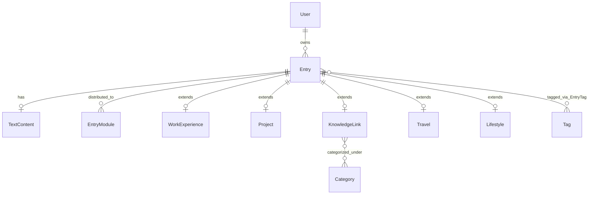

> 一条 Entry 可对应多条 EntryModule 记录，实现多模块展示。

### 3.5 类型子表（各类型专属字段）
#### WorkExperience（工作经历）
| 字段 | 类型 | 说明 |
| :--- | :--- | :--- |
| entry_id | UUID (PK, FK → Entry) | 一对一关联 |
| company | VARCHAR(200) | 脱敏公司名 |
| role | VARCHAR(100) | 职位 |
| start_date | DATE | 开始日期 |
| end_date | DATE | 结束日期（可空，表示至今） |
| tech_stack | JSONB | 技术栈数组 |

#### Project（项目经历）
| 字段 | 类型 | 说明 |
| :--- | :--- | :--- |
| entry_id | UUID (PK, FK → Entry) | 一对一关联 |
| name | VARCHAR(200) | 项目名称 |
| description | TEXT | 简要描述 |
| tech_stack | JSONB | 技术栈 |
| link | VARCHAR(500) | 项目链接 |
| highlights | JSONB | 亮点数组 |

#### KnowledgeLink（知识库外链）
| 字段 | 类型 | 说明 |
| :--- | :--- | :--- |
| entry_id | UUID (PK, FK → Entry) | 一对一关联 |
| url | VARCHAR(500) | 外部链接地址（如飞书文档） |
| category | VARCHAR(100) | 分类（如 React、CSS） |
| tags | JSONB | 标签数组 |
| description | TEXT | 简短描述 |

> MVP 阶段知识库采用外链模式，不内置文章正文。正文仍可通过 TextContent 存储（可选）。

#### Travel（旅行）
| 字段 | 类型 | 说明 |
| :--- | :--- | :--- |
| entry_id | UUID (PK, FK → Entry) | 一对一关联 |
| destination | VARCHAR(200) | 目的地 |
| travel_date | DATE | 旅行日期 |
| tags | JSONB | 标签 |

#### Lifestyle（生活/吃喝玩乐）
| 字段 | 类型 | 说明 |
| :--- | :--- | :--- |
| entry_id | UUID (PK, FK → Entry) | 一对一关联 |
| sub_type | VARCHAR(50) | 子类型：`food` / `daily` / `fitness` 等 |
| tags | JSONB | 标签 |
| date | DATE | 相关日期 |

> 各子类型（food、daily、fitness）通过 `sub_type` 区分，共用 Lifestyle 表，避免过多子表。

### 3.6 标签表 `Tag` 与关联表 `EntryTag`（可选）
**Tag**：
| 字段 | 类型 | 说明 |
| :--- | :--- | :--- |
| id | UUID (PK) | 标签 ID |
| name | VARCHAR(50) UNIQUE | 标签名 |
| slug | VARCHAR(50) UNIQUE | URL 标识 |

**EntryTag（多对多）**：
| 字段 | 类型 | 说明 |
| :--- | :--- | :--- |
| entry_id | UUID (FK) | 条目 ID |
| tag_id | UUID (FK) | 标签 ID |

> MVP 策略：初期可直接在子表中用 `tags JSONB` 存储，减少联表。内容量大时迁移至多对多结构。

### 3.7 分类表 `Category`（树状结构，V2 启用）
| 字段 | 类型 | 说明 |
| :--- | :--- | :--- |
| id | UUID (PK) | 分类 ID |
| name | VARCHAR(100) | 分类名 |
| slug | VARCHAR(100) | URL 标识 |
| parent_id | UUID (FK → Category) | 父级分类（可空） |
| sort_order | INT | 排序权重 |

> 通过 `parent_id` 实现无限层级，用于知识库、博客等内容的系统分类。MVP 阶段可暂不创建。

---

## 四、实体关系图（Mermaid）


## 五、核心查询示例
### 5.1 全局时间轴（所有标记为 timeline 的已发布条目）
```sql
SELECT e.id, e.title, e.type, e.occurred_at, e.summary
FROM Entry e
JOIN EntryModule em ON e.id = em.entry_id
WHERE em.module_name = 'timeline' AND e.status = 'published'
ORDER BY COALESCE(e.occurred_at, e.created_at) DESC;
```

### 5.2 简历页工作经历（指定模块 + 类型过滤）
```sql
SELECT e.id, e.title, w.company, w.role, w.start_date, w.end_date
FROM Entry e
JOIN EntryModule em ON e.id = em.entry_id
JOIN WorkExperience w ON e.id = w.entry_id
WHERE em.module_name = 'resume' AND e.type = 'work_experience' AND e.status = 'published'
ORDER BY COALESCE(w.start_date, e.occurred_at, e.created_at) DESC;
```

### 5.3 项目列表（模块 + 类型过滤）
```sql
SELECT e.id, e.title, e.type, e.occurred_at, e.summary
FROM Entry e
JOIN EntryModule em ON e.id = em.entry_id
WHERE em.module_name = 'timeline' AND e.status = 'published'
ORDER BY COALESCE(e.occurred_at, e.created_at) DESC;
```

### 5.4 知识库外链（模块过滤）
```sql
SSELECT e.id, e.title, k.url, k.category, k.tags, k.description
FROM Entry e
JOIN EntryModule em ON e.id = em.entry_id
JOIN KnowledgeLink k ON e.id = k.entry_id
WHERE em.module_name = 'knowledge' AND e.status = 'published'
ORDER BY e.created_at DESC;
```

### 5.5 朋友圈式时间轴（混合流，可按类型筛选）
```sql
SSELECT e.id, e.title, e.type, e.occurred_at, tc.content
FROM Entry e
JOIN EntryModule em ON e.id = em.entry_id
LEFT JOIN TextContent tc ON e.text_content_id = tc.id
WHERE em.module_name = 'timeline' AND e.status = 'published'
  -- 可选过滤：AND e.type IN ('work_experience', 'project', ...)
ORDER BY COALESCE(e.occurred_at, e.created_at) DESC;
```


### 5.6 简历页工作经历（指定模块 + 类型过滤）
```sql
SELECT e.id, e.title, w.company, w.role, w.start_date, w.end_date
FROM Entry e
JOIN EntryModule em ON e.id = em.entry_id
JOIN WorkExperience w ON e.id = w.entry_id
WHERE em.module_name = 'resume' AND e.type = 'work_experience' AND e.status = 'published'
ORDER BY COALESCE(w.start_date, e.occurred_at, e.created_at) DESC;
```

## 六、智能导入时的数据处理流程
1. 接收文本 → `/api/import` 调用 DeepSeek，系统提示词要求拆分多条并输出 JSON 数组。
2. AI 返回：数组，每项含 `type`、`fields`、建议 `modules`。
3. 前端预览：用户确认类型、勾选模块、编辑字段，可拆分/合并。
4. 确认入库（事务）：
   - 每条：创建 `Entry`（`status = 'published'`，若未指定 `occurred_at` 则取当前时间）。
   - 根据 `type` 在对应子表（`WorkExperience`、`Project` 等）插入记录。
   - 在 `EntryModule` 批量插入用户勾选的模块记录。
   - 在 `TextContent` 存储 Markdown 正文（如适用）。
   - 将 AI 分析原始结果存入 `ai_analysis`（JSONB）。
5. 后续修改：管理后台可编辑任意字段。
6. **深度整理模式特殊处理**：
   - AI 清洗后的完整 Markdown 长文 → 存入 `TextContent.content`
   - AI 清洗前后的文本对比 → 存入 `Entry.ai_analysis`（JSONB，含 `original` 和 `cleaned` 字段）
   - `Entry.summary` 存储 AI 生成的一句话摘要
   - 项目子表的 `highlights` 存储亮点列表（JSON 数组）
   - 若原文包含多媒体链接，在 Markdown 中使用标准语法保留（``、`[视频](url)` 等）

---

## 七、MVP 阶段简化建议
为快速启动，以下功能可暂时跳过：
- 不创建 `User` 表（使用硬编码用户 ID）。
- 不创建 `Category` 树状分类表。
- 标签使用 `tags JSONB` 而非 `Tag / EntryTag` 多对多表。
- `ai_vector` 字段和 pgvector 扩展暂不启用。
- `location` 字段使用简单 JSON `{lat, lng}`，不引入 PostGIS。
- 多媒体内容字段保留，但 MVP 仅支持图片上传。

---

## 八、演进路线图
| 阶段 | 新增内容 |
| :--- | :--- |
| **MVP（当前）** | 核心表 + 类型子表 + 模块分发，Markdown 文本，简单标签，知识库外链 |
| **V2.0** | Category 动态树、Tag 多对多、多媒体完善、EntryStatus 工作流强化 |
| **V3.0** | pgvector 语义搜索、AI 自动标签/摘要、旅行地图可视化、智能推荐 |

本文档与 `CLAUDE.md`、`PRD.md` 配套使用，三者共同构成项目的完整设计与执行依据。
